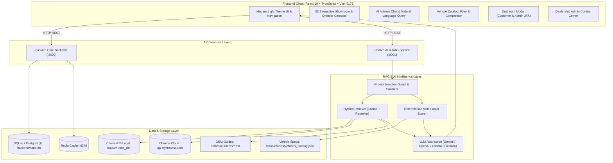

# CarIQ — AI-Powered Smart Car Purchasing & Discovery Platform

> **The definitive next-generation automotive commerce and intelligence platform engineered for the Indian car market.**  
> Powered by **Retrieval-Augmented Generation (RAG)**, **ChromaDB vector persistence (Local & Cloud)**, **multi-provider LLM orchestration**, **deterministic multi-factor recommendation math**, and an **interactive 3D showroom**.

---

## 📑 Table of Contents

1. [Executive Overview](#1-executive-overview)
2. [Key Platform Capabilities](#2-key-platform-capabilities)
3. [Full-Stack Architecture Diagram](#3-full-stack-architecture-diagram)
4. [Project Structure & Directory Map](#4-project-structure--directory-map)
5. [Data Storage & Local Database Locations](#5-data-storage--local-database-locations)
6. [Dual-Tier Authentication & Demo Logins](#6-dual-tier-authentication--demo-logins)
7. [AI & RAG Intelligence Engine](#7-ai--rag-intelligence-engine)
8. [Quick Start & Setup Guide](#8-quick-start--setup-guide)
9. [Docker & Containerized Deployment](#9-docker--containerized-deployment)
10. [Environment Variables Reference](#10-environment-variables-reference)
11. [Complete API Reference](#11-complete-api-reference)
12. [Testing & Quality Verification](#12-testing--quality-verification)

---

## 1. Executive Overview

Car buying in India is typically characterized by pushy sales representatives, fragmented automotive portals, conflicting specs, and subjective opinions. 

**CarIQ** solves this by establishing a single, transparent, and intelligent platform:
- **For Car Buyers:** Natural language search, conversational AI advisory grounded in verified OEM technical specifications, an interactive 3D car showroom with 360° rotation and paint customization, mathematical EMI loan calculators, side-by-side vehicle comparisons, and 1-click test drive scheduling with downloadable receipts.
- **For Dealerships & Admins:** A specialized Control Center providing real-time fleet inventory tracking, test drive request pipeline management, customer lead tracking, and system health telemetry.

---

## 2. Key Platform Capabilities

### 🎨 Modern Visual Experience
- **Refined Light Design System:** Crisp neutral slate backgrounds, soft indigo primary accents, glassmorphic cards, and high-contrast accessible typography.
- **Interactive 3D Showroom:** Three.js / Canvas real-time 3D vehicle viewer featuring 360° orbital rotation, zoom controls, and dynamic paint finish previews.
- **Dynamic 3D Cylinder Carousel:** Interactive rotating cylindrical carousel showcasing cars with real-time specs, match percentage badges, and fluid drag/swipe navigation.

### 🧠 Hybrid RAG & Grounded AI Intelligence
- **ChromaDB Vector Store (Local & Cloud):** Persists document chunks and HNSW vector graphs to local disk (`data/chroma_db/`) or hosted **Chroma Cloud** (`api.trychroma.com`).
- **Multi-Provider LLM Orchestration:** Seamless switching between **Google Gemini**, **OpenAI**, **Local Ollama** (`llama3:8b`), and deterministic local fallback if external LLMs are unreachable.
- **Anti-Hallucination Guardrails:** Strict threshold confidence scoring; retrieved documents are enclosed in guarded token boundaries to eliminate prompt injections and prevent fabricated car specs.
- **Traceable Source Citations:** Every AI answer cites verified OEM spec guides, NCAP crash test reports, or financing guides.

### 🛡️ Dual-Tier Security & Authentication
- **Customer Self-Service Portal:** Email/password authentication, self-registration with location and phone number, and personalized wishlist/booking history.
- **Dealership Admin Portal:** Protected by administrative credentials, secret passkeys, and a 2FA PIN token (`2026`) for fleet and booking management.

### 💰 Verified Financial Engine
- **Exact EMI Mathematics:** Formula-verified loan computations (Principal, Interest Rate, Tenure, Down Payment, Total Repayment) eliminating LLM arithmetic errors.
- **Instant Receipts:** Generates downloadable test drive receipts (`CarIQ_Receipt_*.pdf` or `.json`) with verifiable booking IDs.

---

## 3. Full-Stack Architecture Diagram



---

## 4. Project Structure & Directory Map

```
CarIQ/
├── frontend/                           # React 19 + TypeScript + Vite Web App
│   ├── src/
│   │   ├── components/
│   │   │   ├── 3d/                     # Three.js 3D Car Canvas Viewer
│   │   │   ├── ai/                     # AI Advisor Chat with citations & cards
│   │   │   ├── auth/                   # Dual Auth Modal (Customer & Admin)
│   │   │   ├── home/                   # Home tab & 3D Cylinder Carousel
│   │   │   ├── layout/                 # Navbar, Footer, Theme toggle
│   │   │   ├── vehicles/               # Catalog grid, filter, car comparison
│   │   │   └── welcome/                # Hero banner & welcome animations
│   │   ├── context/                    # AuthContext, ThemeContext
│   │   ├── services/                   # API clients (aiService, authService, ragEngine)
│   │   └── types/                      # TypeScript domain interfaces
│   ├── package.json
│   └── vite.config.ts
│
├── backend/                            # FastAPI Core Business Backend
│   ├── app/
│   │   ├── api/v1/                     # Auth, vehicles, bookings, admin routes
│   │   ├── core/                       # Database config, JWT tokens, security
│   │   ├── models/                     # SQLAlchemy relational models
│   │   ├── schemas/                    # Pydantic request/response schemas
│   │   └── services/                   # Booking engine, catalog CRUD
│   ├── cariq.db                        # Primary SQLite database file
│   ├── .env                            # Backend configuration file
│   └── requirements.txt
│
├── ai_service/                         # FastAPI RAG & AI Intelligence Layer
│   ├── app/
│   │   ├── main.py                     # AI Service lifecycle & router mounting
│   │   ├── api/                        # /ai/chat, /ai/recommend, /rag/search, /health
│   │   ├── ai/                         # Gemini, OpenAI, Ollama providers
│   │   ├── rag/                        # Ingestion, chunking, embeddings, ChromaDB store
│   │   ├── recommendation/             # Deterministic scoring algorithm
│   │   ├── memory/                     # Multi-turn conversational memory
│   │   ├── models/                     # Knowledge and citation domain models
│   │   └── services/                   # Orchestrator & vehicle query services
│   ├── .env                            # AI Service configuration file
│   └── requirements.txt
│
├── data/                               # Knowledge Datasets & Persistent Stores
│   ├── documents/                      # Markdown technical guides (Nexon, Brezza, Creta...)
│   ├── guides/                         # Buying checklists, safety guides, loan FAQs
│   ├── vehicles/                       # vehicles_catalog.json (Structured car catalog)
│   └── chroma_db/                      # Local persistent ChromaDB vector store
│
├── docker-compose.yml                  # Full-stack container orchestration
├── .env.example                        # Template for environment configuration
└── README.md                           # Master documentation
```

---

## 5. Data Storage & Local Database Locations

| Data Category | Storage Type | Physical File / Location |
| :--- | :--- | :--- |
| **User Accounts & Auth** | SQLite / PostgreSQL | `c:\Users\RAMU\Documents\CarIQ\backend\cariq.db` (`users` table) |
| **Test Drive Bookings** | Relational Database | `c:\Users\RAMU\Documents\CarIQ\backend\cariq.db` (`bookings` table) |
| **Downloaded Receipts** | Client Downloads | Automatically generated in user's browser **Downloads** (`CarIQ_Receipt_*.pdf` or `.json`) |
| **Vector Embeddings (RAG)** | ChromaDB (HNSW) | `c:\Users\RAMU\Documents\CarIQ\data\chroma_db\` (or Chroma Cloud) |
| **Vehicle Specifications** | Structured JSON | `c:\Users\RAMU\Documents\CarIQ\data\vehicles\vehicles_catalog.json` |
| **Knowledge Base Markdown** | Markdown / Text | `c:\Users\RAMU\Documents\CarIQ\data\documents/` and `data/guides/` |
| **Session Cache** | Memory / Redis | In-memory cache or Redis at `localhost:6379` |

---

## 6. Dual-Tier Authentication & Demo Logins

CarIQ features distinct customer and admin authentication workflows:

```
                  ┌───────────────────────────────────┐
                  │          CarIQ Auth Modal         │
                  └─────────┬───────────────┬─────────┘
                            │               │
            ┌───────────────▼──┐         ┌──▼────────────────┐
            │  Customer Portal │         │    Admin Portal   │
            │  (Sign In / Reg) │         │ (Passkey + 2FA)   │
            └──────────────────┘         └───────────────────┘
```

### 👤 Customer Access
- **Features:** Self-registration, saved wishlist, test drive scheduling, and personalized preferences.
- **Demo Customer Credentials:**
  - **Email:** `customer@cariq.in`
  - **Password:** `Customer@123`
  - *(Or click **"⚡ Auto-Fill Demo"** in the Customer tab)*

### 🛡️ Dealership Admin Portal
- **Features:** Dealership Control Center, inventory fleet controls, test drive booking approvals/cancellations, and analytics.
- **Admin Access Credentials:**
  - **Admin Email / ID:** `admin@cariq.in`
  - **Security Passkey:** `Admin@CarIQ2026`
  - **2FA Security PIN:** `2026`
  - *(Or click **"⚡ 1-Click Admin Fill"** in the Admin Portal tab)*

---

## 7. AI & RAG Intelligence Engine

### How RAG Operates in CarIQ

```
[User Query: "What is the mileage of Tata Nexon?"]
                    │
                    ▼
       [Input Guard & Sanitization]
                    │
                    ▼
     [Embedding via all-MiniLM-L6-v2 / tfidf_fast]
                    │
                    ▼
    [ChromaDB Vector Retrieval (HNSW Cosine)]
     ├── Local Disk: data/chroma_db/
     └── Or Cloud: api.trychroma.com
                    │
                    ▼
        [Top-K Candidate Reranking]
                    │
                    ▼
      [System Prompt Grounding + Context Isolation]
                    │
                    ▼
     [LLM Response Generation with OEM Citations]
```

1. **Ingestion:** Technical guides (`data/documents/`) are parsed into semantic chunks (`SemanticVehicleChunker`).
2. **Embedding:** Chunks are vectorized using high-performance embedding models.
3. **Vector Store:** ChromaDB stores and indexes chunks using HNSW cosine similarity.
4. **Context Grounding:** Top matching chunks are injected into guarded prompt context blocks.
5. **Citations:** Every response links directly to verified source documentation.

---

## 8. Quick Start & Setup Guide

### Prerequisites
- **Node.js** (v18 or higher) & **npm**
- **Python** (v3.10, v3.11, or v3.13)
- Git

---

### Step 1: Clone & Navigate
```bash
git clone https://github.com/your-repo/CarIQ.git
cd CarIQ
```

---

### Step 2: Frontend Web Application
```bash
cd frontend
npm install
npm run dev
```
> The frontend will launch at: **`http://localhost:5173`**

---

### Step 3: Core Backend Service
```bash
cd ../backend
python -m venv venv

# Windows:
.\venv\Scripts\activate
# Linux/macOS:
source venv/bin/activate

pip install -r requirements.txt
uvicorn app.main:app --host 0.0.0.0 --port 8000 --reload
```
> Core Backend Swagger docs: **`http://localhost:8000/docs`**

---

### Step 4: AI & RAG Intelligence Service
```bash
cd ../ai_service
pip install -r requirements.txt
uvicorn app.main:app --host 0.0.0.0 --port 8001 --reload
```
> AI Service Swagger docs: **`http://localhost:8001/docs`**

---

## 9. Docker & Containerized Deployment

To start the entire CarIQ full-stack ecosystem with a single command:

```bash
# From repository root:
docker compose up --build
```

This spins up:
- **Frontend Container:** `http://localhost:5173`
- **Core Backend Container:** `http://localhost:8000`
- **AI Intelligence Container:** `http://localhost:8001`
- **PostgreSQL Database:** Port `5432`
- **Redis Cache:** Port `6379`

---

## 10. Environment Variables Reference

Copy `.env.example` to `.env` in `backend/` and `ai_service/`:

```ini
# ==========================================
# Server & Environment
# ==========================================
ENVIRONMENT=development
DEBUG=true
PORT=8000
HOST=0.0.0.0
CORS_ORIGINS=http://localhost:5173,http://localhost:3000

# ==========================================
# AI Provider (gemini, openai, ollama, mock)
# ==========================================
AI_PROVIDER=gemini
AI_MODEL=gemini-1.5-flash
AI_API_KEY=your_gemini_api_key_here
AI_TEMPERATURE=0.2
AI_MAX_TOKENS=1024

# ==========================================
# Vector Store & ChromaDB (Local or Cloud)
# ==========================================
VECTOR_STORE_TYPE=chromadb

# ChromaDB Cloud Configuration (api.trychroma.com)
CHROMA_HOST=api.trychroma.com
CHROMA_API_KEY=YOUR_API_KEY
CHROMA_TENANT=2e1d0851-8816-41df-ac83-a28ee9181f29
CHROMA_DATABASE=ramu

# ==========================================
# Database & JWT Authentication
# ==========================================
DATABASE_URL=sqlite+aiosqlite:///./cariq.db
JWT_SECRET_KEY=cariq_super_secret_jwt_key_2026_production
JWT_ALGORITHM=HS256
ACCESS_TOKEN_EXPIRE_MINUTES=60
```

---

## 11. Complete API Reference

### AI & RAG Service Endpoints (`http://localhost:8001`)

| Method | Endpoint | Description |
| :--- | :--- | :--- |
| `POST` | `/api/v1/ai/chat` | Conversational RAG assistant with OEM source citations |
| `POST` | `/api/v1/ai/recommend` | Deterministic multi-factor car recommendation scoring |
| `POST` | `/api/v1/ai/compare` | Side-by-side vehicle spec and trade-off comparison |
| `POST` | `/api/v1/ai/explain-recommendation` | "Why This Car?" match breakdown and scoring factors |
| `POST` | `/api/v1/ai/search` | Natural language semantic vehicle search |
| `POST` | `/api/v1/ai/extract-preferences` | Natural language slot extraction (budget, fuel, seating) |
| `POST` | `/api/v1/rag/search` | Direct vector similarity search across ChromaDB |
| `POST` | `/api/v1/rag/ingest` | Trigger knowledge base re-indexing into ChromaDB |
| `GET`  | `/api/v1/health` | Health telemetry, ChromaDB mode (`cloud` vs `local_disk`), and indexed chunks |

### Core Backend Endpoints (`http://localhost:8000`)

| Method | Endpoint | Description |
| :--- | :--- | :--- |
| `POST` | `/api/v1/auth/register` | Customer registration (name, email, phone, city, password) |
| `POST` | `/api/v1/auth/login` | Dual authentication (Customer / Admin portal) |
| `GET`  | `/api/v1/vehicles` | Search, filter, and page through vehicle catalog |
| `GET`  | `/api/v1/vehicles/{id}` | Retrieve detailed vehicle specifications and variants |
| `POST` | `/api/v1/bookings` | Schedule dealership or home test drive |
| `GET`  | `/api/v1/bookings/my-bookings` | Retrieve authenticated customer's booking list |
| `GET`  | `/api/v1/admin/bookings` | Dealership admin view of all scheduled bookings |
| `PATCH`| `/api/v1/admin/bookings/{id}` | Approve, reschedule, or cancel test drive bookings |

---

## 12. Testing & Quality Verification

### Run AI & Backend Unit Tests
```bash
pytest -v tests/
```

### Run Automated RAG Benchmark
```bash
python scripts/evaluate_rag.py
```

### Run Frontend Production Build Check
```bash
cd frontend
cmd /c "npm run build"
```

---

## 🤝 License

CarIQ is licensed under the **MIT License**. All documentation, code, and architectures are open for contributions and customization.
